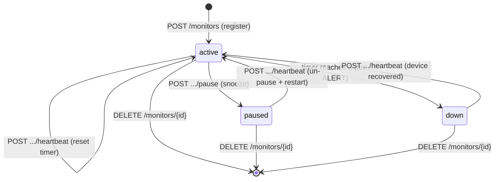
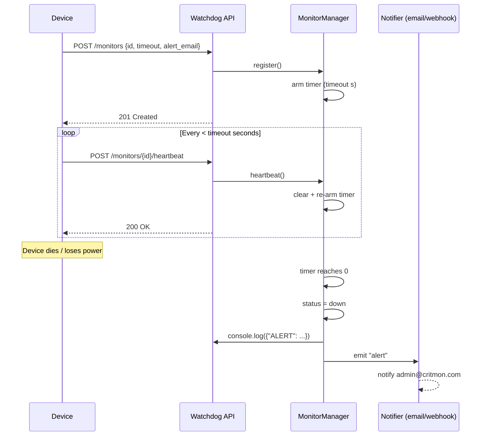

# Pulse-Check-API — "Watchdog" Sentinel

A **Dead Man's Switch API** for monitoring remote, low-connectivity devices (solar farms, unmanned weather stations). Each device registers a *monitor* with a countdown timer and must "ping" (send a heartbeat) before the timer runs out. If a heartbeat is missed, the system automatically fires an alert and marks the device as **down**.

Built with **Node.js + Express**, with **zero runtime dependencies beyond Express** and an in-memory state machine.

---

## 1. Architecture

### How it works

The core is an in-memory `MonitorManager` that owns one `setTimeout` timer per monitor. A heartbeat clears and re-arms the timer; if the timer ever actually fires, the device is declared down and an alert event is emitted. The HTTP layer (Express) is a thin shell over the manager, and the manager is an `EventEmitter`, so notification channels (email, webhooks) subscribe without coupling.

### State Machine



### Sequence Diagram (the happy path + failure)



---

## 2. Setup Instructions

**Requirements:** Node.js 18+ (uses native `node:test`, ESM, `--watch`).

```bash
# install dependencies
npm install

# start the server (default port 3000, override with PORT)
npm start
# -> Watchdog Sentinel listening on http://localhost:3000

# run the test suite (8 tests covering every acceptance criterion)
npm test
```

To use a different port: `PORT=8080 npm start`.

---

## 3. API Documentation

All request/response bodies are JSON. Base URL: `http://localhost:3000`.

| Method | Path | Purpose |
|--------|------|---------|
| `POST` | `/monitors` | Register a new monitor (US1) |
| `POST` | `/monitors/:id/heartbeat` | Reset timer / un-pause / recover (US2) |
| `POST` | `/monitors/:id/pause` | Snooze — stop the timer (Bonus) |
| `GET`  | `/monitors` | List all monitors |
| `GET`  | `/monitors/:id` | Get one monitor |
| `DELETE` | `/monitors/:id` | Remove a monitor |
| `GET`  | `/health` | Liveness / count / uptime |

### Register a monitor — `POST /monitors`

```bash
curl -X POST http://localhost:3000/monitors \
  -H "Content-Type: application/json" \
  -d '{"id":"device-123","timeout":60,"alert_email":"admin@critmon.com"}'
```

Body fields: `id` (string, required), `timeout` (number of seconds, required, > 0), `alert_email` (string, optional).

**`201 Created`**
```json
{
  "message": "Monitor 'device-123' created. Countdown started for 60s.",
  "monitor": { "id": "device-123", "status": "active", "secondsRemaining": 60, "...": "..." }
}
```
Errors: `400` invalid input, `409` id already exists.

### Heartbeat — `POST /monitors/:id/heartbeat`

```bash
curl -X POST http://localhost:3000/monitors/device-123/heartbeat
```
Resets the countdown. If the monitor was `paused` or `down`, it returns to `active`.

**`200 OK`** with the updated monitor. **`404`** if the id is unknown.

### Pause / Snooze — `POST /monitors/:id/pause`

```bash
curl -X POST http://localhost:3000/monitors/device-123/pause
```
Stops the timer entirely; no alert can fire. The next heartbeat automatically un-pauses and restarts the countdown.

**`200 OK`** with the updated monitor. **`404`** if unknown.

### The Alert (failure state)

When a timer reaches zero with no heartbeat, the server logs:
```json
{"ALERT": "Device device-123 is down!", "time": "2026-06-15T14:56:03.564Z"}
```
…the monitor's status becomes `down`, and (if `alert_email` was set) the notifier hook logs the intended email. This hook is the single place to wire a real webhook or SMTP send.

---

## 4. The Developer's Choice: Auto-Recovery + Flap Tracking

**What I added:** When a device that has already gone **down** sends a heartbeat again, the system automatically transitions it back to **active**, emits a `"recover"` event (logged as `{"RECOVERED": ...}`), and increments a `missedDeadlines` counter that persists on the monitor.

**Why:** The brief covers *going down* but is silent on *coming back*. In real infrastructure monitoring, devices reboot, power is restored, and connectivity returns — and operators care just as much about recovery as about failure. Without this:

- A revived device would stay stuck reporting `down` forever, polluting dashboards and causing engineers to roll repair trucks to a device that already fixed itself.
- There'd be no way to distinguish a device that's **flapping** (repeatedly dying and recovering — a sign of an intermittent fault like a failing battery) from a healthy one.

The `missedDeadlines` count makes flapping visible: a monitor that's `active` but has `missedDeadlines: 7` is a different operational story than one with `0`, even though both look "fine" right now. This turns the switch from a one-shot tripwire into a continuous health signal, which is what a monitoring company actually needs.

I also added small support endpoints (`GET /monitors`, `GET /monitors/:id`, `DELETE /monitors/:id`, `GET /health`) so the service is observable and testable rather than write-only.

---

## Project Structure

```
src/
  monitorManager.js   # in-memory state machine + timers (the core)
  app.js              # Express routes + input validation
  server.js           # entry point, notifier hooks, graceful shutdown
test/
  monitor.test.js     # 8 tests covering US1, US2, US3, Bonus, Dev Choice
```

## Notes & Trade-offs

State is held **in memory** for simplicity, as the brief allows. This means monitors are lost on restart and the service can't be horizontally scaled as-is. The clear next step for production would be to back monitors with a persistent store (e.g. Redis with TTL keys, or Postgres + a sweep worker) so timers survive restarts and multiple instances can share state.

---

## 5. Deploying to Render

This repo includes a `render.yaml` blueprint, so deployment is mostly automatic.

1. Push this project to a GitHub repository.
2. In the [Render Dashboard](https://dashboard.render.com), click **New +** → **Blueprint**.
3. Connect your GitHub repo. Render will detect `render.yaml` and propose a web service called `pulse-check-api` with everything pre-filled (build command `npm install`, start command `npm start`, health check path `/health`).
4. Click **Apply** / **Create**. Render builds and deploys automatically.
5. Once live, your API is reachable at `https://<your-service-name>.onrender.com`.

**No blueprint? No problem** — you can set this up by hand instead:
- New + → Web Service → connect your repo
- Build Command: `npm install`
- Start Command: `npm start`
- Health Check Path: `/health`

Render automatically sets a `PORT` environment variable for you — `src/server.js` already reads `process.env.PORT`, so no code changes are needed. Every future `git push` to your linked branch triggers a new automatic deploy.

**Note on the free plan:** Render's free web services spin down after a period of inactivity and spin back up on the next request (causing a slower first response, often called a "cold start"). Because all monitor state lives in memory (see Notes & Trade-offs above), a spin-down will also wipe any monitors you'd registered — fine for a demo, but worth knowing about.

## License

MIT — see [LICENSE](./LICENSE).
